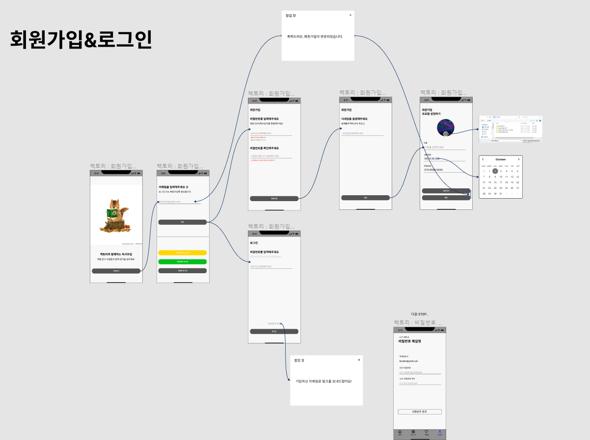

# 20210719_회의록

## 🌞 모닝 스크럼

### Daily Contents

#### **REST API 설계**

- REST API에서 Method를 구분할 것
- URL에 해당하는 값이 들어가면 안 됨

[나쁜 설계 ❌](https://www.notion.so/a0fe2aa0a7d8401385ca2b8964414c35)

[좋은 설계 👌](https://www.notion.so/82e945dcbd364960b9800df0070f61f3)

- Parameter는 조건에 해당

[Untitled](https://www.notion.so/5659333370ca46d1ad5330221b51a00d)

- 모든 값을 가져오는 REST API URL은 where 절이 없어야 하므로, Parameter 또한 없음

[Untitled](https://www.notion.so/14a6d0c817e54fea982ab0ad261022b3)

### 오전 스크럼

- 예은
  - 토요일 : JPA 인강 수강
- 원기
  - 피그마 강의 완강 + 실습
  - 웹캠 보유자가 많을까 -> 웹서비스가 맞을까?, 모바일 환경은 어떨지
  - 기능 설계 바탕으로 정보 설계 + 와이어프레임 전 스케치 작업하면 좋을 듯
- 지연
  - 피그마 튜토리얼 강의 학습 + 기본적인 기능 실습
- 원선
  - JPA, API 설계법 학습
  - 프로젝트 기능 생각

### 주요 논의

- 모바일 기반 vs 웹 기반
  - 모바일
    - 장점
      - 웹캠 부재 문제 해결
      - 공간 구애받지 않고 활용 가능
      - 최근 대부분 모바일 기반의 서비스로 옮겨가는 추세
    - 단점
      - 긴 글을 작성하기엔 다소 불편
      - 다중 화상 모임하기엔 화면상 애매할 수도 -> 가로 전환으로 해결 가능
  - 웹
    - 장점
      - 긴 글을 작성하는 것이 수월
      - 화상 모임에 다중 인원 참석 가능
    - 단점
      - 웹캠 부재 문제 발생
      - 알림이나 1대1 메시지 등 특정 기능은 웹에서 구현하기 살짝 애매
- 모바일로 하기로 결정
  - 서비스 및 화면 레퍼런스
    - 리더스
    - 갓피플 성경
    - 북클럽 - Just Show Up
    - 트레바리
    - 밀리의 서재

## 🌟 팀미팅

- 와이어프레임 작업

- 기능명세 보강

  

## 🌜 랩업 미팅

### 마무리

- 프로젝트 과소 평가하지 말자
  - 시간 모자르지 않게 일정에 맞춰서 잘하자
- 서영은 교육생 소감
  - 코치님, 컨설턴트님께 질문 많이 했었는데 잘 대답해주셔서 감사
  - 욕심이 많은 편이라 팀원분들께도 많이 요구했던 것 같은데 들어주셔서 감사
  - 앞으로도 열심히 하겠다! 우리 반 다 화이팅~
