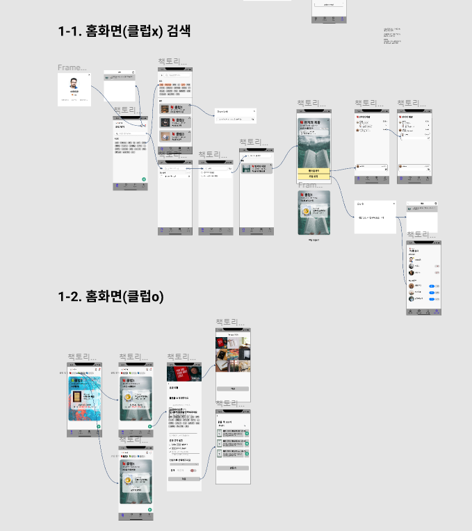
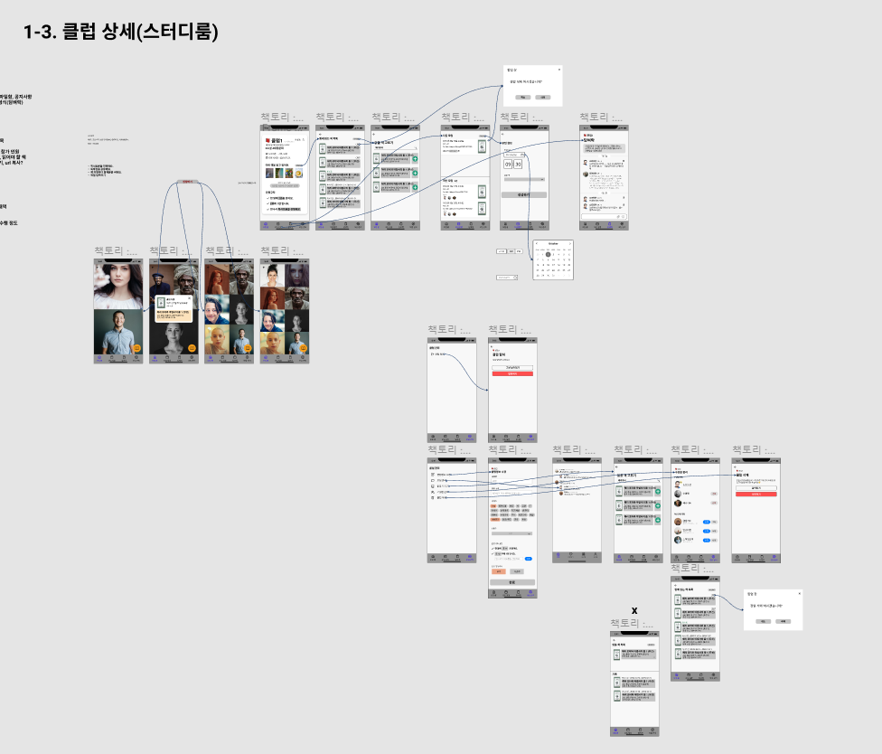
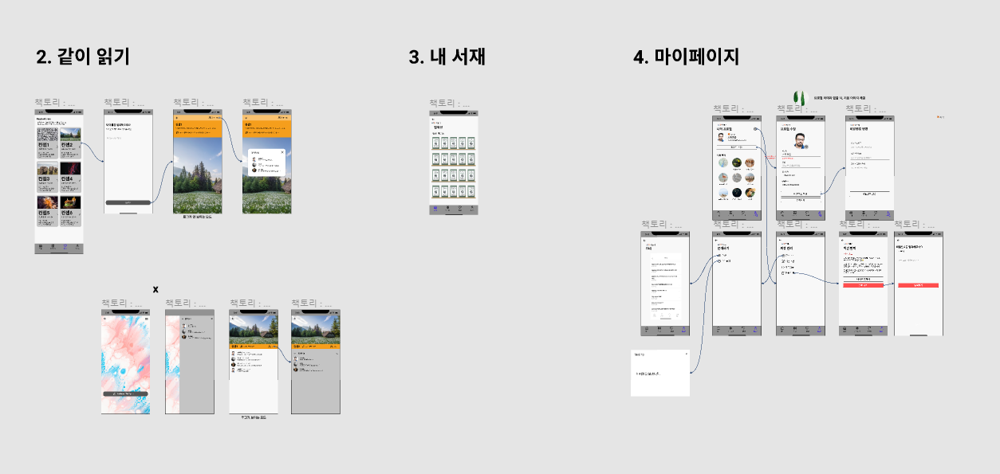

# 20210720_회의록

## 🌞 모닝 스크럼

### Daily Contents

- 변수는 Scpoe가 적은 것부터 사용
  - 변수의 scope (사용범위) 가 클수록 가독성이 떨어짐
  - 멤버 변수 (왼쪽) 보다 로컬 변수 (오른쪽) 을 사용하는 것이 코드해석이 더 빠름
  - but, 성능을 고려할 경우 일부러 멤버변수를 사용할 수 있음

#### **const, let, var의 차이**

- const

  - 재할당 X, 재선언 X

  ```jsx
  const text = 'test'
  text = 'abc'        // error
  const text = 'ddd'  // error
  ```

- let

  - 재할당 O, 재선언 X

  ```jsx
  let text = 'test'
  text = 'abc'      // ok
  let text = 'ddd'  // error
  ```

- var

  - 재할당 O, 재선언 O

  ```jsx
  var text = 'test'
  text = 'abc'      // ok
  var text = 'ddd'  // ok
  ```

- `const < let < var` 순으로 기능이 많음

- 코드를 작성할 때 기능이 가장 적은 const를 우선으로 사용

  - 다음으로 let, var 순으로 사용

- why? 기능이 많을수록 가독성이 떨어지기 때문에

- 참고 자료

  [var, let, const 차이점](https://velog.io/@bathingape/JavaScript-var-let-const-차이점)

- `private < protect < public` 순으로 기능이 많음

  - 접근제어자도 범위가 좁은 것을 우선으로 사용

### 데일리 스크럼

- Gather 함께 사용해봤음
  - 게임 잘 버렸다ㅎㅎ eraser 괜찮다!
- 와이어프레임 설계 끝내기 (공동 목표)


## 🌟 팀미팅

- 와이어 프레임 작업








## 🌜 랩업 미팅

- 3팀 회고
  - 팀원 부재로 3명이서 진행
  - 친해지는시간 , 수다타임
  - 팀장 부재로.. 몰아가기 해서 본인이 발표함
  - 와아아~
- 본인 실력이 부족하다고 팀한테 민폐끼친다고 생각하지마세요 ~!
- 잘못되었을때 내가 문제라고 생각하지마세요 ~
- 회사 가서도 내 잘못이 아니라 회사 잘못일수도 있다, 객관적으로 보자!
  - ((( 나 )))
