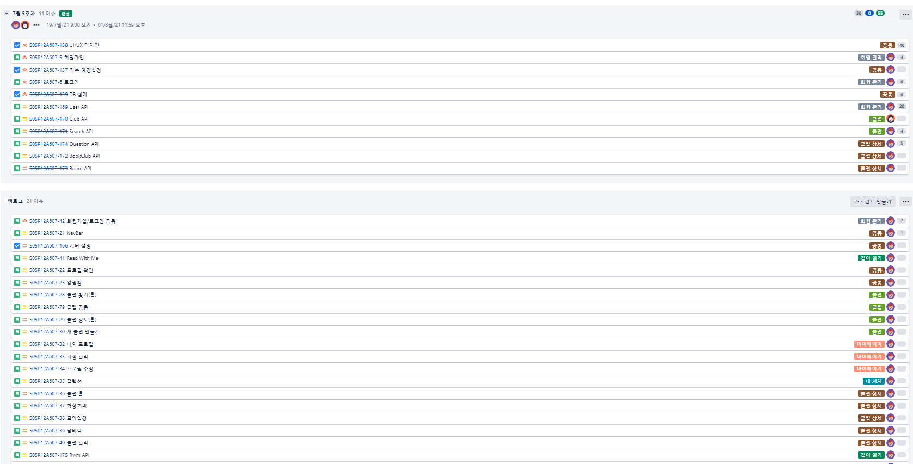

# 20210723_회의록

## 🌞 모닝 스크럼

### Project Review

- 라이브 방송에서 프로젝트 진행 시 필요할만한 부분만 정리했어욥

#### 컴포넌트 단위 개발하기

- 알림창, 캘린더 등 컴포넌트 단위로 개발하면 재사용 가능
- 잘 만들어두면 공통 프로젝트뿐만 아니라 추후 특화 프로젝트에서도 사용 가능
- 자신만의 컴포넌트 만들기!

#### 와이어프레임

- 잘 만들고 그대로 개발하자
- 협업을 통해 빠르게 개발 가능

#### 공식 문서

- 공식 문서가 어렵지만 가장 정확한 방법
- 블로그보다 공식 문서 참고하자

### Daily Contents

- 어제 질문 많이 들어왔던 Query String에 대해 예시를 통해 설명

#### REST API 및 Query 작성 **예제**

- 포인트 추가 및 내역 조회에 대한 예제
- 저장된 Database 내용

[REST API 및 Query](https://www.notion.so/ad769b6a74624a428cc6d6f5ad29f593)

- 사용한 포인트를 음수로 표시하기 때문에 0보다 작다는 조건을 이용해서 지출 기록 조회 가능

### 데일리 스크럼

- 어제 작성한 ERD 다같이 확인
  - erdcloud에 team member 초대가 안 돼서 그냥 새로 만듦...
  - 배지 테이블 없애고 프론트에서 json 파일 갖고 있기로 결정!
- 와이어프레임 변경 사항 확인
- 원기 : 면접 잘 보고 왔음. 면접 복기한 것 필요하면 공유해주겠음! ⇒ 감사감사
  - 면접 갔는데 싸피 많더라~ ㅇ0ㅇ...
  - 너무 더웠다... ⇒ 밥도 못먹고 고생했어....

## 🌟 팀미팅

- REST API 문서 작성(일부 발췌)

| Mapping | Resources                   | Explanation             | Method | Header    | Request                                                      | Response                                                     |
| ------- | --------------------------- | ----------------------- | ------ | --------- | ------------------------------------------------------------ | ------------------------------------------------------------ |
| users   | /                           | 회원정보 등록           | POST   |           | **email : String nickname : String password : String **name : String birth : Date profile_img : String phone : String | statusCode : 201, message : "success"                        |
|         | /login                      | 일반 로그인             | POST   |           | email : String password : String                             | statusCode : 201 body {   token : String }  statucCode : 401 body {   message : "잘못된 비밀번호입니다." } |
|         | /{id}me                     | 회원정보 확인           | GET    | JWT Token |                                                              | statusCode : 200, body { id : Long, nickname : String, name : String, birth : Date, profileImg : String, phone : String, mainBadge : Integer, club_count : Integer, book_count : Integer, badgeList : [   num : Integer ], } |
|         | /{id}                       | 회원정보 수정           | PATCH  | JWT Token | **id : Long ****nickname : String** name : String birth :  profile_img : String phone : String | statusCode : 200,  message : "success"                       |
|         | /{id}/password              | 비밀번호 수정           | PATCH  | JWT Token | id : Long, cur_password : String new_password : String       | statucCode : 200 body {   message : "success" }  statucCode : 401 body {   message : "잘못된 비밀번호입니다." } |
|         | /{id}                       | 회원탈퇴                | DELETE | JWT Token | id : Long, password : String                                 | statusCode : 204,  message : "success"                       |
|         | /{id}/books                 | 내가 읽은 책 확인       | GET    | JWT Token |                                                              | statusCode : 200, body { book_list : [   id : Long,   title : String,   thumbnail : String, ] } |
|         | /{id}/main-badge/{badge_id} | 대표배지설정            | PATCH  |           | badge_id : Integer                                           | statusCode : 200,  message : "success"                       |
|         | /email/{email}              | 이메일 중복확인         | GET    |           | email : String                                               | statusCode : 409, body {   "loginUser" : String }  statusCode : 200, body {   "registerUser" : String } |
|         | /nickname/{nickname}        | 닉네임 중복확인         | GET    |           | nickname : String                                            | statusCode : 409, body {   "fail" : String }  statusCode : 200, body {   "success" : String } |
|         |                             |                         |        |           |                                                              |                                                              |
| clubs   |                             | 클럽정보 확인           | GET    |           |                                                              | statusCode : 200, body { name : String, date : Date, img : String, info : String, maxMember : Integer, isOpen : Boolean, volumRule : Integer, weekRule : Integer, freeRule : String } |
|         | /user/{userId} /list        | 클럽목록 확인           | GET    |           |                                                              | statusCode : 200, body { clubs : [   id : Long,   name : String   ] } |
|         | /                           | 새 클럽 등록            | POST   |           | **name : String leaderId : Long** img : String info : String **maxMember : Integer isOpen : Boolean** volumRule : Integer weekRule : Integer freeRule : String genres : [   genreId : Integer ] books : [   bookId : Long ] | statusCode : 201, message : "success"                        |
|         | /{id}                       | 클럽 정보 수정          | PATCH  |           | id : Long, name : String, img : String, info : String, maxMember : Integer, isOpen : Boolean, volumRule : Integer, weekRule : Integer, freeRule : String, genres : [   genreId : Integer ] | statusCode : 200,  message : "success"                       |
|         | /{id}/book                  | 클럽 읽을 책 추가       | POST   |           | book_id : Long  books : [   book_id : Long ]                 | statusCode : 201, message : "success"                        |
|         | /{id}/join                  | 클럽 가입신청           | POST   |           | id : Long user_id : Long state : Enum                        | statusCode : 201, body{   id : Long }                        |
|         | /{id}/join                  | 클럽 가입승인           | PUT    |           | **userClubId: Long **club_id : Long user_id : Long state : Enum | statusCode : 200,  message : "success"                       |
|         | /{id}/join/{userClubId}     | 클럽 탈퇴/클럽 가입거절 | DELETE |           | userClubId: Long                                             | statusCode : 204,  message : "success"                       |
|         | /{id}/user/{userId}         | 클럽 탈퇴               | DELETE |           |                                                              | statusCode : 204,  message : "success"                       |
|         | /{id}                       | 클럽 삭제               | DELETE |           |                                                              | statusCode : 204,  message : "success"                       |
|         | /{id}/users                 | 클럽 가입자/신청자 목록 | GET    |           | clubId : Long                                                | statusCode : 200, body { userClubs : [   Id : Long,   userId : Long,   state : String, ] } |

- 지라 이슈 생성 및 관리
  - Stroy 생성 => 하위 테스크 생성
  - Stroy 포인트 예상
  - FE/BE 역할 태그
  - 담당자 설정
  - 150개 이슈  생성

## 🌜 랩업 미팅

### SSAFY 전달 사항

- 코로나 백신 맞으면 당일 공가, 발열 있으면 추가 공가
  - 증명서로 증빙
  - 추가 공가는 진료확인서로 증빙
- 코로나 설문 허위 작성 No!
  - 설문 잘 작성해주세요~
  - 결혼식 같은 외출도 다 기록
- 다음주 황현승 프로님 자리 비울 예정, 이정훈 프로님께 문의~

### 6팀 회고

- 이번 주에 팀원들과 설계하면서 바뀐 거 많아서 힘들었지만 같이 만들어서 좋았음
- 다들 프로젝트 진행하느라 힘들었을텐데 주말에 리프레쉬 하시고 힘내시길!

### 종례

- git 시작하면 conflict 발생 할 수밖에 없음
  - conflict 잘 해결한다고 잘 하는 개발자는 아님
  - 어디서 발생 했을까 원인을 보자!
  - 원인을 파악하고 잘 해결하자~
