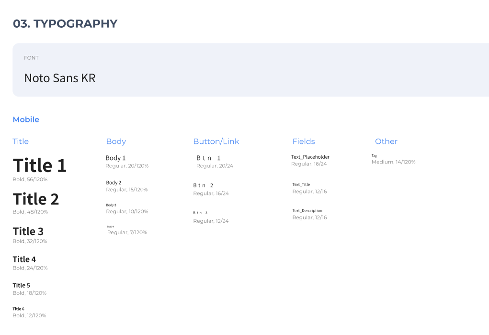
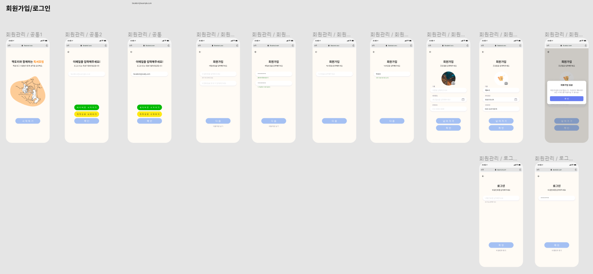

# 20210726_회의록

## 🌞 모닝 스크럼

### 데일리 스크럼

- 원선
  - AWS 도메인 받은 거 확인해봤음
  - JPA 이론을 깊게 공부하기 보다 어떤 식으로 사용하면 좋을지 공부
  - 스프링 시큐리티, JWT 어떻게 코드 짜야할지 공부
- 예은
  - JPA 강의 실습만 들었어서 이론 강의 앞부분 들었음
  - Git 컨벤션 위해서 Git Flow 찾아봤음
    - 개념은 알겠는데 어떻게 하면 좋을지 공부 더 필요
- 원기
  - 레퍼런스 조사, 자료 수집
    - 메인 컬러, 다람쥐 캐릭터 등 찾아봄
    - figma community 탐색~~
  - 이번 주에 할 것들 준비하고 가닥 잡으려고 함
  - UI 작업 참고용 자료 → Notion에 올려두겠음
  - 시각화 과정에서 프레임 바뀔수도 있을 듯
  - 이번주 목표는 "빨리" 작업물 만들기
  - 작업 속도 향상을 위해 디자인에서의 컨벤션도 만들고 작업
- 지연
  - 피그마 강의 수강
  -   컨벤션, 컴포넌트 생각해서 디자인하는 게 중요해서 미리 세팅 필요할 듯
  - vue 관련 코드는 직접 부딪혀가면서 해봐야 될 듯
  - 깃 컨벤션 얘기해봅시다
  - 컴퓨터 위치 조정..힘들었따..

## 🌟 팀미팅

- UI 디자인 컨셉 설정 및 회원가입/로그인 화면
- JPA API 

## 🌜 랩업 미팅

### 진행 상황

- Front-end
  - 회원가입/로그인 프로토타입 디자인
  - 기본 스타일 선정
  - 제플린 연결 해 볼 예정
- Back-end
  - DB 연결 해보는 중
  - 잘 안 되고 있다... → 이번에 될 수도 있어!
