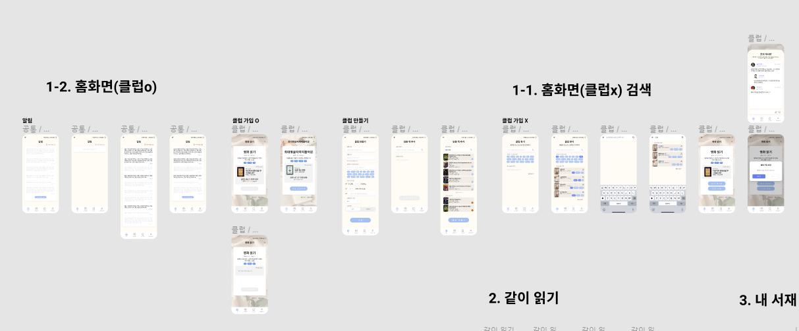
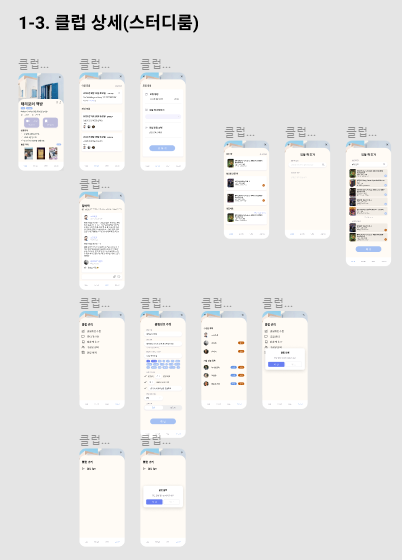
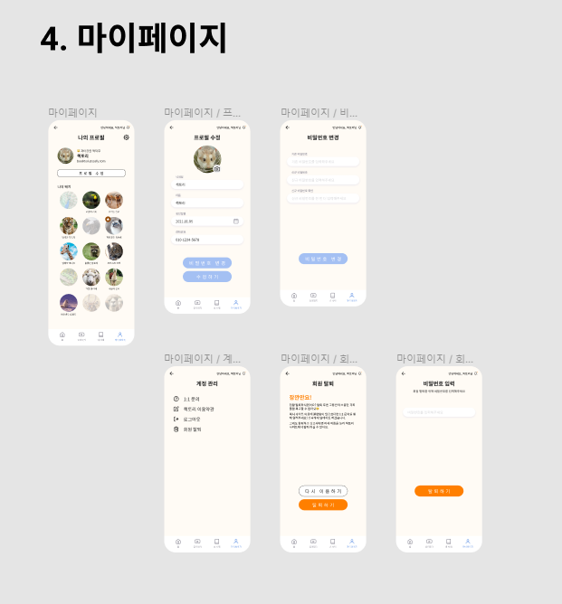

# 20210728_회의록

## 🌞 모닝 스크럼

### 관심사 분리 (Separation of Concerns, SoC)

> IT Essential - 이상현 컨설턴트

#### 관심사 분리란 무엇인가?

- 컴퓨터 프로그램을 구별된 부분으로 분리시키는 디자인 원칙
- 모든 프로그래밍 패러다임의 지향점
- 컨설턴트님이 가장 중요하게 생각하는 것

#### 관심사 분리

- 이미 무의식 중에 하고 있음, 단지 깨닫지 못했을 뿐
- 함수를 만들고 호출하는 것이 코드 레벨의 관심사 분리!
- 

### Daily Content

#### 같이 사용되는 변수 Class로 묶기

- 필수 변수 : 출발지에 대한 변수, 도착지에 대한 변수

- 같이 사용되는 변수는 오른쪽처럼 묶어서 관리
  - 가독성도 좋아지고 결함도 낮아지고~

#### 불필요한 변수 사용하지 않기

- 필수 정보 : 반지름

- 불필요한 area 변수는 없애고 area 값이 필요할 때 바로 계산해서 return
- radius 값이 바뀜에 따라서 area 값도 바뀌어야 하는데 왼쪽같이 할 경우 결함이 유발될 가능성 높음
- 만약 area 값이 빈번하게 사용될 경우 성능은 왼쪽이 좋음
- but, 가독성과 결함 측면에서 오른쪽이 더 좋다~


### 컨설턴트님 말씀

- 개발하면서 문제 생겼을 때 우회하지말고 정면 돌파해라
- 그렇게 공부하고 부딪혀보면서 실력이 는다... → 그게 경쟁력이 됩니다~~
- 회사에서 '이 사람 아니면 안 되겠구나' 하는 사람이 되자!
  - 대체 불가능한 인력🧐 그래야 돈도 많이 받는다
- 오늘도 화이팅


### 데일리 스크럼

#### 지연

- 메인 페이지, 클럽 등록 페이지 수정
- 로그인/회원가입 ui 어떻게할지 고민 -> 수정된 걸로 확정!
- 클럽 찾기 페이지 작업 예정

#### 원선

- 스프링 시큐리티, JWT 부분 하고 master에 머지 함
- develop에 해야 하는데 실수... 지금은 다시 develop 파둠!

#### 예은

- 스터디 끝나니 11시...
- 오늘은 '원선'님이 명령하신^^ 클럽 API 짤 예정

#### 원기

- 클럽 상세 페이지 수정
- 상세 페이지 내 클럽 관리 페이지 작업 예정


## 🌟 팀미팅

- BE 오늘의 할 일

- [x] User API 개발
- [ ] club API 개발

- FE 오늘의 할 일

- [x] 클럽 상세 UI
- [x] 클럽 찾기 UI ⇒ 오늘 마무리
- [ ] Vuejs + Jeplin css 입히기

```
10:00~11:50 UI 작업6
13:00~15:00 UI 작업7
15:00~15:30 피그마 레이어 정리
16:00~18:00 피그마 레이어 정리 2
야근...
19:30~21:30 피그마 레이어 정리 3
```








## 🌜 랩업 미팅

#### 8팀 회고

- 설계를 다 끝내고 개발에 들어갔는데 생각보다 개발 속도 안 나온다ㅠ
- 같이 협업 하기도 쉽지 않다...
  - 데일리 스크럼을 통해 잘 헤쳐나가는 중!
- 교수님이랑 코치님 도움도 많이 받고 있다~~
- 같이 힘내서 좋은 결과 만들어 보자!

#### 컨설턴트님 말씀

- 혼자가 아니라 팀원들 있으니까 같이 힘내서 아자자자
- 취업특강 잘 들으세요~~~
