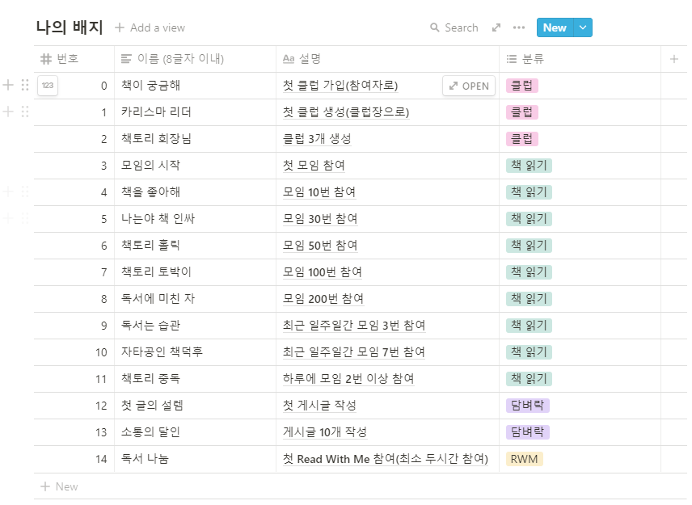

# 20210806_회의록

## 🌞 모닝 스크럼

### 지연

- 배지 획득 했을 때 회원정보에서 배지 정보 수정 해주는 api 필요
  - api 문서에만 없는지 안 만들었는지 확인 필요
  - 배지 넘버를 넘기면 그부분 비트 1로 바꿔주기
- 배지 이름, 내용, 획득 조건, 배치 순서 정하기
- 마이페이지 메인 페이지 구현(배지 부분)
- 프로필 수정, 계정 관리 메뉴 페이지 할 예정

### 원선

- 어제는 알림 쪽 알아보느라 시간을 많이 씀
- 이제 많이 알아봤으니 오늘 본격 개발할 예정
- 알림 DB 우리가 만든 거 안 쓸 수도 있을 듯 → 서버에서 관리?
- 알림 UI에 대한 수정이 필요하지 않을까...?
  - 알림 버튼 클릭 시 알림 모두 읽음 처리 등,,,
- 배지 부분 고민도 필요할 듯

### 예은

- RWM api 새로 시작 하면서 사소한 실수 하는 바람에 시간이 오래 걸림
- 이제 버그 수정 했으니 짜는 건 오전 안에 끝낼 수 있을 것 같음
- 오후에는 서버에 배포하는 거 확인해 볼 예정!

### 원기

- 클럽 검색 페이지 만드는 중
  - 너무 깊어요,,,
- SCSS 강의 구입
- 클럽 검색 페이지, 클럽 만들기 ⇒ 보완 필요
- 클럽 상세 ⇒ 시작

## 🌟 팀별 발표 정리

### 1팀 `9번`

- 초등생 교육용 그룹 화상 회의 서비스, 아이이뽀
- 프론트엔드: API 연결 우선 진행
- 백엔드: 못 적었네...ㅎㅎㅎ
- 작업물 시연 보여줌~~~ 많이 보여줌...

### 2팀 `4번`

- 기능 구현 소개는 동영상으로 준비 했음
- 어제까지 개발한 내용 배포
- 회원가입 이메일 인증, 소셜 로그인
- 책에 대한 이미지, 내용 보여짐
- 챌린지 페이지 - 이벤트
- 프로필, 로그인, 탈퇴 등 회원 관리 기능 구현

### 3팀 `2번`

- 프론트엔드: 페이지 제작, 푸시 알람 구현
- 백엔드: REST API 제작, 푸시 알람 구현
- 프론트엔드, 백엔드 나눠서 진행 중
- 푸시 알람 시연...!
- 이번주에 푸시 알람 구현 하느라 노력 했음

### 4팀 `8번`

- WebRTC 연결: OpenVidu 사용
- 구현 및 개선된 기능
  - 화상미팅 방: 프로젝트에 맞춰서 수정해서 사용
  - 비밀번호 찾기: 임시 비밀번호 이메일 발송
  - 입장 화면
- 추후 일정: 미팅 방 입퇴장 및 이력 관리 등 기능 개발~

### 5팀 `1번`

- 주차 별 일정 잡고 Notion으로 업무 분담
- Jira에는 좀 더 상세한 계획 잡아서 이슈 관리
- 백엔드 계획대로 진행 중 이제 마무리 단계
- 프론트엔드는 얼추 틀을 잡아둔 상태
- 머지 할 때는 꼭 리뷰 받고 하기~~~
- 매일 스크럼 회의 진행, 회의록 기록

### 6팀 `7번`

- 비건을 위한 실천형 SNS
- OVL, 서비스 소개~~ (적기 귀찮아여...)
- 백엔드: SQL 변경 될 때마다 버전 표시, ERD 설계, Jira로 관리
  - 대부분이 프론트엔드 작업 중
  - 버그 발견 시 파일 수정 및 배포 준비 중
- 프론트엔드: 목업의 구체화 → 피그마를 이용한 재작성, SCSS 모듈화, 프레임워크 최소화
- 이후 계획: 기능 구현 / 코드 클리닝 / 배포

### 👑 7팀 `3번`

- 예은이 수고 했어용 👏👏👏

### 8팀 `6번`

- 운동 게이미피케이션 서비스
- 요구사항 설계서대로 잘 구현하고 있음
- 와이어프레임 설계, 심플하게~
- 모션인식 정확도 높일 수 있게 가이드라인 제공
- 백엔드, 프론트엔드, WebRTC 진행 상황
  - 백엔드는 구현 거의 끝나가는 중
  - 프론트엔드는 진행 중~~~
  - WebRTC는 Openvidu 서버 배포 등
- 팀원 소개: 백엔드 3 + 프론트엔드 1

### 9팀 `5번`

- 화상회의 서비스를 통한 취업박람회
- 2D 게임 UI
- Key Color 선정
- Unity 사용 계획 → Unity + React로 변경
  - React Unity WebGL npm 사용
- 스크럼 회의 진행, 노션으로 기록
- 나머지는 최종발표 때 보여드릴게요~

## 🌜 랩업 미팅

