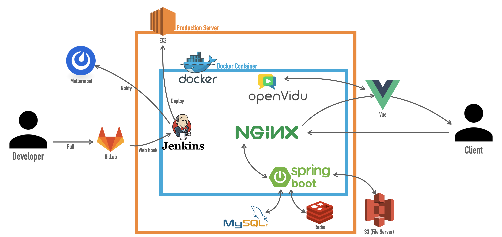

# 🛠 Porting Manual

> 책토리는 아래와 같은 환경에서 서비스중이며, 다음과 같은 방법으로 실행할 수 있습니다.

#### ⚙️ 시스템 환경

- CPU : `Intel(R) Xeon(R) CPU E5-2686 v4 @ 2.30GHz`
- OS : `Ubuntu 20.04 LTS (GNU/Linux 5.4.0-1018-aws x86_64)`
- Total Memory : `16396056 kB`

#### 🖥 시스템 구성

- `Jenkins 3.7 - blueocean` : CI/CD tool
- `Docker` : Backend/Frontend(`nginx`) 컨테이너 실행
  - Frontend(nginx)와 Backend는 도커를 통해 각각 다른 컨테이너에서 실행되고 있습니다.
- File server : ` AWS S3`
- `nginx` : docker에서 Frontend를 실행하며, Backend를 redirecting 합니다.

#### 💻 개발 환경

- Java `1.8`
- MySQL `5.7`
- IntelliJ IDEA ULTIMATE `2020.3`

- Node.js `14.17.0 LTS`

- Visual Studio Code`1.59.0`

#### 💽 기술 스택

##### ⚫️ Back-end

- Gradle
- spring-boot `2.5.3`
- spring-boot-data-jpa
- spring security
- spring-boot-starter-data-redis
- spring-boot-starter-mail
- swagger`2`
- jjwt
- lombok
- junit `5`
- firebase-admin

##### 🟡 Front-end

- Vue.js `2`
- SCSS
- firebase

##### 🔴 Infra

- AWS EC2 - deply server
- AWS S3 - file server
- nginx , docker, jenkins
- gitlab, mattermost

#### ♾ DevOps

> 배포플로우



#### 🕹 Install & Usage

##### 🔵 SSL Key 발급

> 이미 발급받은적이 있다면 해당 작업은 무시해도 무관합니다.

```
$ sudo apt-get install letsencrypt
$ sudo letsencrypt certonly --standalone -d <www제외한 도메인 이름>
```

##### 🟠 Docker network 설정

> Frontend, Backend 각각 서로 다른 container에서 실행되기때문에 docker network를 이용한 연결이 필요합니다.

```bash
$ sudo docker network create booktorycicdnetwork
```

##### 🟠 Docker image 생성

> Frontend, Backend 내의 `Dockerfile` 을 이용하여 이미지를 생성하는 과정에서
> Frontend, Backend 프로젝트 각각의 실행환경과 build 파일이 생성됩니다.

```bash
/* 다음 명령은 project root directory에서 수행합니다.*/

$ docker build -t frontend:latest ./frontend/
$ docker build -t backend:latest ./backend/
```

##### 🟠 Docker container 실행

> Frontend는 nginx 환경에서 실행되며, 따로 실행된 Backend 컨테이너는 niginx로 요청된 url (`/api`)에 따라 redirecting 됩니다.

```bash
/* 다음 명령은 project root directory에서 수행합니다.*/

$ docker run -d --name frontend -p 80:80 -p 443:443 \
  -v /etc/letsencrypt:/cert -v /etc/localtime:/etc/localtime:ro \
  --network booktorycicdnetwork frontend:latest

$ docker run -d --name backend -p 8080:8080 \
  --network booktorycicdnetwork backend:latest
```

##### 위의 설치 및 실행 과정에서 사용되는 설정파일들은 다음과 같습니다.

- `../frontend/Dockerfile`
- `../frontend/homepage.conf`
- `../backend/Dockerfile`

##### 이 외 해당 디렉토리에 포함하는 파일은 다음과 같습니다.

- 데이터베이스 덤프파일
- 시연 시나리오
